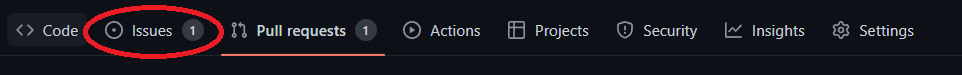
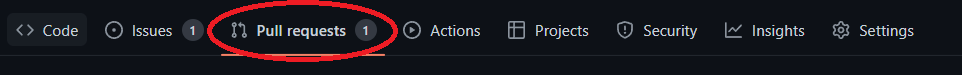
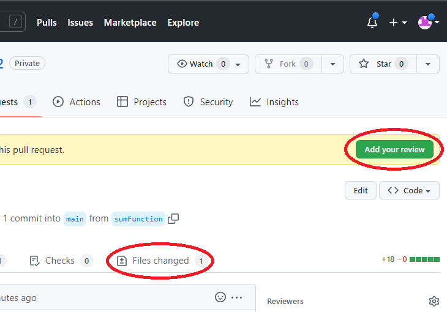
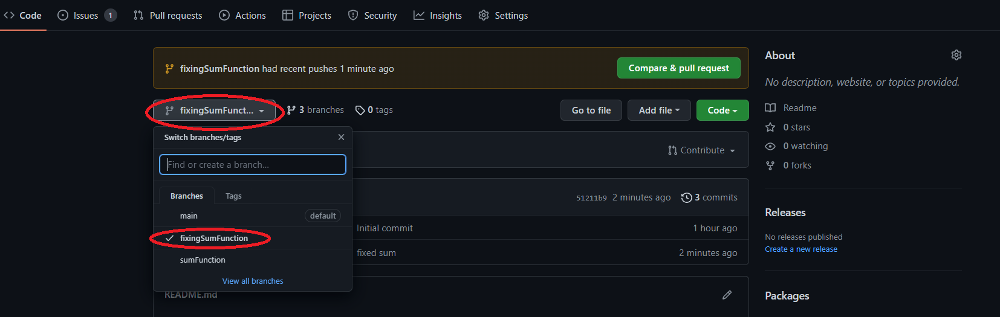
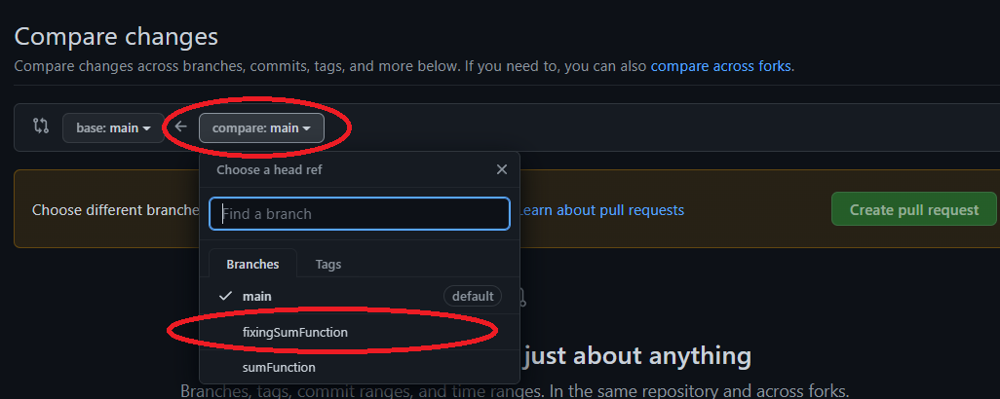
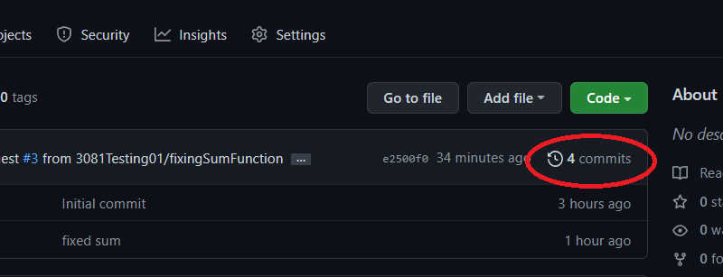
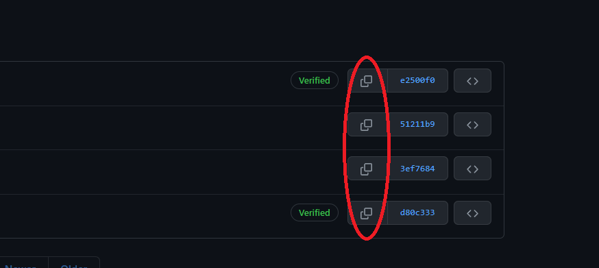

A great class note about Git: https://missing.csail.mit.edu/2020/version-control/

# 3081 Lab 1: Git
_(Due: Thursday, September. 15, 2022 @ 11:59pm)_

In this assignment, you will become familiar with Git and some of its standard and advanced features. You will simulate a collaborative environment where you and a team will be working to build a simple summation calculator and using Git to keep track of code changes. It is recommended that you have basic knowledge of how to use the command line in Linux. The rest of this document is divided into two parts *General Information*, and *Lab Instructions*. The *General Information* section provides instructions on the background required for this lab and how to access a lab machine to complete the assignment. (If you would like to use your own machine to complete the lab, that is ok but we may not be able to provide troubleshooting help for errors that might be machine-related. If needed, you can find how to install Git on your machine at this [link](https://git-scm.com/downloads).) The section *Lab Instructions* details the instructions for this lab.

Finally, we suggest to read this assignment by accessing this file on GitHub.


## General Information

### Background

If you are not familiar with using the command line, you can find a tutorial [here](https://ubuntu.com/tutorials/command-line-for-beginners#1-overview). (For this tutorial, you can use a lab machine; see details in the next paragraph.) In this course, we are going to use the command line extensively and we suggest you feel comfortable using it. 

### Accessing a Lab Machine

For this assignment, we suggest you use a lab machine in ***Keller Hall 1-250*** or ***Keller Hall 1-262*** ([details](https://cse.umn.edu/cseit/classrooms-labs#cselabs)), as Git is already installed on these machines. You can also access a lab machine remotely using SSH or a web-based service called FASTX. You will use your CSE Labs account to login to the lab machines. If you do not already have an account, create the account following these [instructions](https://wwws.cs.umn.edu/account-management).

If you are using FASTX, you can access the machine by going to the webpage https://csel-kh1250-XX.cselabs.umn.edu where XX is the machine identifier number, and `kh1250` represents the machine is in the Keller 1-250 lab. In Keller 1-250, the machine numbers are 01-37, and in Keller 1-262 the machine numbers are 01-28. Please do not use the machine in the example below, choose a different one so the entire class isn't trying to work off of the same computer. For example, if you choose to use machine 09 in Keller 1-250, you should type into your web browser [https://csel-kh1250-09.cselabs.umn.edu](https://csel-kh1250-09.cselabs.umn.edu) to connect to your machine. Use your CSE account to login to the machine. One you login, click the + icon in the top left to create a new session, then choose XFCE and click Launch.

If you are using SSH, you will use the same hostnames as described in how to connect with FASTX. For example, if you'd like to connect to machine 09 in Keller 1-250, you will do `ssh X500@csel-kh1250-09.cselabs.umn.edu`, where `X500` is your x500 ID that is registered as a CSE Labs account.


**IMPORTANT: Inside the lab machine, only files saved to your home folder (e.g., `/home/kaung006`) will persist across sessions. If you log out, make sure your progress is pushed to GitHub or saved in the home folder.**

**IMPORTANT: One of the reasons you might not be able to log into a lab machine is that you reached your CSE Labs Account disk quota. To free space, please use these [instructions](https://cse.umn.edu/cseit/self-help-guides/disk-quota-free-your-space). (In some cases, you might need to SSH into a CSE classroom or lab machine to complete the instructions.)**

**IMPORTANT: Remember to log out from the lab machine when you completed your work session on this lab (especially if you are working remotely), as this operation will allow other students to connect to the same machine.**


## Lab Instructions

In the following sections, we use the term "REPO" to indicate the GitHub repository that we have created for you. This repo is located at https://github.umn.edu/umn-csci-3081-F22/x500-lab01 where x500 is your x500 ID. **Make sure that this is not a repository you created on your own.** Please let your Grad TA know if you do not have this repo created for you.

Please also make sure to read the whole assignment before getting started and to follow the instructions we provide to the letter (e.g., use the exact commit messages and capitalizations provided in the assignment, rather than variations of them). If you don’t know how to accomplish a task, either consult Git's help by running `git --help <command>` in a terminal, or leverage online resources (there are plenty, such as this [Git cheat sheet](https://education.github.com/git-cheat-sheet-education.pdf)). If you receive an error while executing a Git command, make sure to read the error message, as Git often suggests exactly the right thing to do.

This lab is meant for beginners to become familiar with Git and GitHub. If you feel like you are completely lost, ask your classmates, TA's, and instructors for help. You can also look at our class lecture on "Git". In addition, you can check the tutorials at [link1](http://try.github.io/levels/1/challenges/1) and [link2](https://learngitbranching.js.org), which should further get you familiar with Git’s basic concepts. There are also plenty of helpful YouTube tutorials and articles online as well.

### Part 0 (GitHub SSH Keys)
GitHub requires users to authenticate every time they want to upload code to any repository, or download code from a private repository. You can type in your username/password every single time, but instead you will setup SSH keys to automatically authenticate your computer with GitHub's servers.

1. Generate an SSH key and add it to the SSH agent. [Follow the instructions here.](https://docs.github.com/en/authentication/connecting-to-github-with-ssh/generating-a-new-ssh-key-and-adding-it-to-the-ssh-agent#generating-a-new-ssh-key) You will need to open a terminal on your computer to run the commands in the guide. Stop after you've added your SSH key to the ssh-agent. Step 3 of Adding your SSH key to the ssh-agent is what we'll be doing next.
2. Add your key to the github.umn.edu server. [Follow the instructions here.](https://docs.github.com/en/github/authenticating-to-github/adding-a-new-ssh-key-to-your-github-account) Make sure you are adding your key to github.umn.edu, NOT github.com.


### Part 1 (Basics)
In this section, you will learn how to clone an existing repository in GitHub onto your lab machine, make a file, then upload it to GitHub.
1. Open a terminal window
2. Make a new folder for this class (e.g. `mkdir csci-3081w-f22`)
3. Go into this new folder (`cd csci-3081w-f22`)
4. Next you're going to configure Git with your name and email address. Run the following commands, replacing "your name" and "x500@umn.edu" with the appropriate values: <br>
```
git config --global user.name "your name"
git config --global user.email "x500@umn.edu"
```
(You can also set your delfaut editor if you would like. For example, to set vim as the default editor, use `git config --global core.editor vim`.)

5. Now you're going to clone your REPO with the following the command. <br>
***Note: replace x500 with your actual x500***
    ```
    git clone git@github.umn.edu:umn-csci-3081-F22/x500-lab01.git
    ```
If this command fails, you haven't setup your SSH keys correctly. Review Part 0 to make sure you completed all the steps.

6. Now you should have a directory called `x500-lab01` (e.g., `kaung006-lab01`)
7. Go to directory `x500-lab01`
8. Create a file called `README.md` that contains only your x500 on the first line.
9. Now, upload your `README.md` file to GitHub. To do so, first ***Add*** the file, then ***commit*** it to your local repo with comment "Added README" and finally ***push*** it to your github server.<br>
    
    This command will add the `README.md` file to the commit. Alternatively, you can use `-A` tag to add all the files inside the directory.
    ```
    git add README.md
    ```

    This will commit your added files to the commit stage with the description of what you provide after the tag `-m`.
    ```
    git commit -m "Added README"
    ```

    This will finally push your committed files onto the GitHub server.
    ```
    git push
    ```
10. Now go to https://github.umn.edu/umn-csci-3081-F22/x500-lab01 (replace x500 with your actual x500) and see if your file is inside the repo.
11. Make sure you can see your README file in your repo before proceeding.

### Part 2 (Issues, Pull request and Code Review)
**Scenario**: Your teammate Ash has written codes which contain a function to calculate the **summation** of two numbers and would like to merge it to the main branch in the GitHub repo.

**Your task**: Review your teammate code and see whether it is correct or incorrect and depending on this decide whether you would like to accept their code to release OR reject their code.  

1. Go to your repo on GitHub using an internet browser, https://github.umn.edu/umn-csci-3081-F22/x500-lab01 (replace x500 with your actual x500)
2. Locate to Issues tab
    <p align="center"></p>
3. In this issues tab, you can see the what type of issues is needed for current repo such as fixing bug, adding new feature, request to change new UI/UX and so on. As of now, you will see the issue called "New Feature: Sum function". 
4. Click on that existing issue and you will see that it is requesting to implement new feature which will add two numbers together and print out the sum.
5. Ash has already written code to solve this issue. But he would like you to review his code and see if it makes sense or has any bugs.
6. Locate to Pull requests tab
    <p align="center"></p>
7. In this pull requests tab, it shows the requests which want to merge into the main base code.
8. Now click on the "Added sum function" pull request.
9. Here you will see that you have been requested to review your imaginary teammate's code.
10. To see the code that is written for you to review, click on the **Add your review button** on right top of the page. If you cannot find this, then locate to the **Files changed tab**
    <p align="center"></p>
11. After clicking, you will see the code that is written by Ash. Now review the code (***Note: the code should SUM two numbers.***). There is a bug inside the code which you would need to tell to Ash.
12. If you found the bug, then click on the line number on the leftside. This will allow you to leave a comment, now write a comment to let Ash know that his code has bug in it.
13. After writing the comment, press "start review" button.
14. Then on the top right hand side, click on the "Finish your review" button. 
15. Select "Request changes". This would let Ash know that you have already review their code and it need to change something.
16. Click "Submit review"
17. DO NOT CLICK MERGE PULL REQUEST as the code that is written inside this request is wrong and we do not want to merge the code with bug in it.
18. Since this pull request consist of incorrect code, we can now close the pull request by clicking "Close pull request" on bottom of the page.<br>
In real world, after we do code review, we let others first review their own code by reading our feedback and fix it first, then accept the code and do merge pull request.

#### Part 3 (Branching, and Creating pull request)
From part 2, you know that the code that is written by Ash is incorrect. He also gave you permission to fix the code by yourself. So, now's time to fix and merge it into the main base code.
1. Go back to your CLI / terminal.
2. Locate to your REPO.
3. Enter the following command:
    ```
    git branch -a
    ```
    This will list out all the branches that exists inside the REPO. If you do not know what **branch** means or what is it, then review the lecture slides on Git or read documentation [here](https://docs.github.com/en/pull-requests/collaborating-with-pull-requests/proposing-changes-to-your-work-with-pull-requests/about-branches) from GitHub.
4. Here you will see:
    ```
    * main
    remotes/origin/HEAD -> origin/main
    remotes/origin/main
    remotes/origin/sumFunction
    ```
5. The asterisk symbol indicates the branch you are currently in.
6. Since you would like to continue the work from Ash's code, go to his branch (sumFunction branch).
    ```
    git checkout sumFunction
    ```
7. Check again in your terminal to see whether you are now inside the sumFunction branch.
    ```
    git branch -a
    ```
8. If the asterisk is before the sumFunction then proceed to step 9, else redo the step 6.
9. Now that you are inside Ash's branch, create new branch from it that contains all of his previous work. To create new branch, run the following commands:
    ```
    git branch fixingSumFunction
    ```
    Then go to the newly created branch.
    ```
    git checkout fixingSumFunction
    ```
    
10. Check to see whether you are now inside the fixingSumFunction brunch or not (see step 7 if you forget how).
11. Then edit the `sum.cc` file to fix the bug that you previously found. Use any text editor/IDE you would like.
12. After fixing the bug, add, commit, and push the code to the server (see Part 1 step 8 if you forget how).
    Note: Instead of using `git push`, now do `git push origin fixingSumFunction`. This tells the server you are uploading the files into that `fixingSumFunction` branch.
13. Now go to your repo in the browser and see whether your codes are in your new branch or not. You might need to refresh the page.
    <p align="center"></p>
14. If you see your correct code, then go to the `Pull requests` tab (see Part 2 step 6 if you cannot find where it is).
15. Click `New pull request`.
16. Click the `compare: main` box and select `fixingSumFunction`.
    <p align="center"></p>
17. Leave the `base: main` as it is.
18. Click `Create pull request`. 
19. Now click `Create pull request` again. <br>
This will create a pull request to merge into the base code.
20. On the right hand side, click the `development` section and select `New Feature: Sum function`. <br>
This means your current pull request is for the `New Feature: Sum function` issue.
21. You do not need to request a code review from anyone for this part, so if you think your code is correct and you follow everything correctly, then click `Merge pull request`.
22. Click `Confirm merge`.
23. Go to the `Issues` tab and now you will see that there is no more open issues. This is because you marked your pull request to fix the `New Feature: Sum function` issue.

#### Part 4 (Creating Issues)
In previous parts, we have seen how to push files to GitHub and solve the existing issues but not how to create an issue.
This section will show you how to create issues on Github.

**Scenario**: Many users are want a subtraction feature added to the program.

**Your task**: Create an issue which indicates the implementation request for subtraction feature. 

1. Go to your GitHub Lab 1 repository on github.umn.edu.
2. Locate `Issue` tab (see Part 2 step 2 if you forget how).
3. Click `New Issue` on right side.
4. In the title, type "*New Feature: Subtraction function*".
5. In the comment section, type "*Request: Have a feature which will take two numbers and subtract second number from the first number, then print out the value.*"
6. On the right side, set `Assignees` to yourself.
7. Set `Labels` to `enhancement` as this issue is to request new feature.
8. Click `Submit new issue`.
9. This will create new `issue` item.

#### Extra (No extra credit will be given)
If you would like, you can implement the subtraction feature and merge it into the main base code to close the issue.

Now you have completed your lab!!!

### Final Submission

To submit your assignment, post on the Gradescope assignment "Lab 1: Git" your x500 and the commit ID of your latest commit to the main branch. You can get this commit ID by running `git log -1` in your repo in the terminal, OR by clicking the clock button on your repository on the Github webpage (see below for picture). The commit ID is the long hexadecimal number after "commit" (e.g., `27d96ac109d66d1a40631b4eacbb1d2acc0e7623`). <br>
**Note: You can resubmit the lab multiple times on gradescope before the due date, but we will only grade the commit that you provided. Meaning, if you make more changes after the due date or did not submit your latest commit ID, we will not grade those but the one that you provide on gradescope**
    <p align="center"></p>
    Choose which commit you would like to copy. The top most commit is the latest commit you performed.
    <p align="center"></p>
