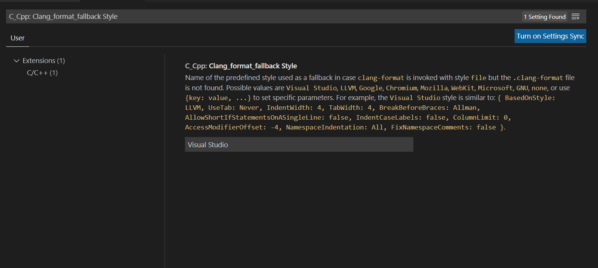

# 3081 Lab 4: Code Styling
_(Due: Thursday, October. 6, 2022 @ 11:59pm)_

## General Information

### Accesing a Lab Machine

For this assignment, we suggest you use a lab machine in ***Keller Hall 1-250*** or ***Keller Hall 1-262*** ([details](https://cse.umn.edu/cseit/classrooms-labs#cselabs)). You can access a lab machine also remotely using [VOLE](https://github.umn.edu/umn-csci-3081-F22/shared-upstream/tree/main/FAQs/VOLE) and [SSH](https://github.umn.edu/umn-csci-3081-F22/shared-upstream/tree/main/FAQs/SSH).

**IMPORTANT: Inside the lab machine, only files saved to your home folder (e.g., `/home/kaung006`) will be persisted across sessions. If you log out, make sure your progress is pushed to GitHub or saved in the home folder.**

### Diskquota Exceed
One of the reasons you might not be able to log into a lab machine is that you reached your CSE Labs Account disk quota. <br>
To free up space, [see here](https://github.umn.edu/umn-csci-3081-F22/shared-upstream/tree/main/FAQs/CSE%20Disk%20Quota%20Exceeds)


## Retrieve Class Materials

1. Clone **public lab04** repo
    ```bash
    git clone git@github.umn.edu:umn-csci-3081-F22/public-lab04.git
    ```

2. Clone your **private lab04** repo<br>
    *Note: **replace** x500 with your x500*
    ```bash
    git clone git@github.umn.edu:umn-csci-3081-F22/x500-lab04
    ```

3. Copy the content of **public lab04** repo into your **private lab04** repo and you can start working inside your private repo.

## Lab Instructions

You will be refactoring some of the codes inside libs/routing/src folder to match the Google code style while maintaining the project structure.

### How to make sure your code style matches the Google style?
We will be using **cpplint** program as this program follows the Google code styling guideline which is perfect for us.
1. Before everything, try to run the program and see whether it worked or not.

    Inside the lib/ and src/ there are codes which takes in .osm file type and produce the shortest path from one point to another using 3 different algorithms (A*, Dijkstra and Depth First Search). This will be used in later labs to determine the path to choose. 

    1. To run the program, first locate to the your repo and go into the src folder
    2. Run `make` to build the applications
        ```
        make
        ```
    3. Note it builds all the applications. Let's execute them:<br>
    Usage: ./pathFinding_app [input graph] [output pic name]
        ```
        ./pathFinding_app ../lib/routing/data/umn.osm umn.png
        ```
        You can find the input graphs inside lib/routing/data
    4. Checkout the output path picture inside the src folder.  You should probably see something like this depending on the input file:
    <p align="center"></p>

    - Green line  : A* algorithm (fastest route from Top Left to Bottom Right)
    - Orange line : Dijkstra algorithm (fastest route from Middle left to Middle Right)
    - Red line    : Depth First Search algorithm (a route from Top left to Bottom Right)

2. If it is showing error then let one of the TAs know about this.
3. Before proceeding, make sure you are in top folder and not inside the src folder.<br>
Run cpplint onto one of the src files
    ````bash
    cpplint --filter=-legal/copyright,-build/include,-build/namespaces,-runtime/explicit ./lib/routing/src/graph.cc
    ````
    *The filter keyword is to filter the errors that we do not want, which in our case, we want to exclude 4 cases (legal/copyright, build/include, build/namespaces, runtime/explicit).*<br>

    You will see something like
    ````bash
    ./lib/routing/src/graph.cc:10:  Line ends in whitespace.  Consider deleting these extra spaces.  [whitespace/end_of_line] [4]
    ./lib/routing/src/graph.cc:17:  An else should appear on the same line as the preceding }  [whitespace/newline] [4]
    .
    .
    .
    ./lib/routing/src/graph.cc:65:  Namespace should be terminated with "// namespace routing"  [readability/namespace] [5]
    Done processing ./lib/routing/src/graph.cc
    Total errors found: 9
    ````
    This means that there are 9 total errors that doesn't match the Google styling guide inside the graph.cc. 
4. Go into the `graph.cc` file and try to fix the errors manually by reading the errors output.
5. Check again using the cpplint to see whether the errors are still there or not using the command below. 
    ````bash
    cpplint --filter=-legal/copyright,-build/include,-build/namespaces,-runtime/explicit ./lib/routing/src/graph.cc
    ````
6. Manually checking and trying to fix the errors to match the styling guideline is very tedious. So, we would use some plugins to do this automatically.
7. We will be using Visual Studio Code editor to match the styling guideline.<br>
Open this lab folder inside the Visual Studio Code.
8. Press the extension icon  on the left side OR press Ctrl + Shift + X
9. Search **C/C++** in the search bar
10. Then click on the first choice (C/C++, not C/C++ Extension Pack)
11. Press install
12. Go to the setting under File tab -> Preference -> Setting
13. Search "C_Cpp: Clang_format_fallback Style"
14. You will see something like the pic below
<p align="center"><p>

15. Change the "Visual Studio" into "Google"
16. Open the file that you would like to change the code style inside the visual studio by clicking the file icon  and selecting the file to open
17. Now is time to do apply the styling automatically. Press "Ctrl + Shift + P" and find **"format document"** then press ENTER OR press "Ctrl + Shift + I" as shortcut key. This will automatically format your codes into the styling that we specify (Google style guideline)
18. Note that this will **not fix** all the guideline that is needed, however this will reduce it tremendously
19. Check again using the cpplint on the graph.cc file and see whether it reduces the errors or not (see step 5 if you forget how).
20. Repeat the step 17 for all of the .cc files inside the lib/routing/src folder including parsers/ routing/ but NOT util/
21. Now check it using the cpplint on all the files by using the command below
    ````bash
    cpplint --filter=-legal/copyright,-build/include,-build/namespaces,-runtime/explicit --exclude=./lib/routing/src/util --recursive ./lib/routing/src
    ````
    The filter keyword is to filter the errors that we do not want, which in our case, we want to exclude 4 cases (legal/copyright, build/include, build/namespaces, runtime/explicit).
    The exclude keyword excludes the files/folder that we do not want to check, which in our case the util folder. 
22. There should be some errors left which the plugin cannot fix. For those errors, you would need to manually fix it.
23. Finally, there should be only 0 errors left after you run the command from step 21. If your final errors matches this, then you have completed the lab.
    ```bash
    Done processing lib/routing/src/bounding_box.cc
    Done processing lib/routing/src/graph.cc
    Done processing lib/routing/src/parsers/obj/obj_graph.cc
    Done processing lib/routing/src/parsers/osm/osm_graph.cc
    Done processing lib/routing/src/parsers/osm/osm_graph_factory.cc
    Done processing lib/routing/src/parsers/osm/osm_parser.cc
    Done processing lib/routing/src/routing/pathing.cc
    Done processing lib/routing/src/routing_api.cc
    ```
24. Now recheck whether the program still work or not by following step 1.
24. Push your refactored code to github.

### Final Submission

To submit your assignment, post on the Gradescope assignment "Lab 4: Code Styling" your x500 and the commit ID for your submission.<br>
[Click here](https://github.umn.edu/umn-csci-3081-F22/shared-upstream/tree/main/FAQs/Commit%20ID) to see how to obtain commit ID.
