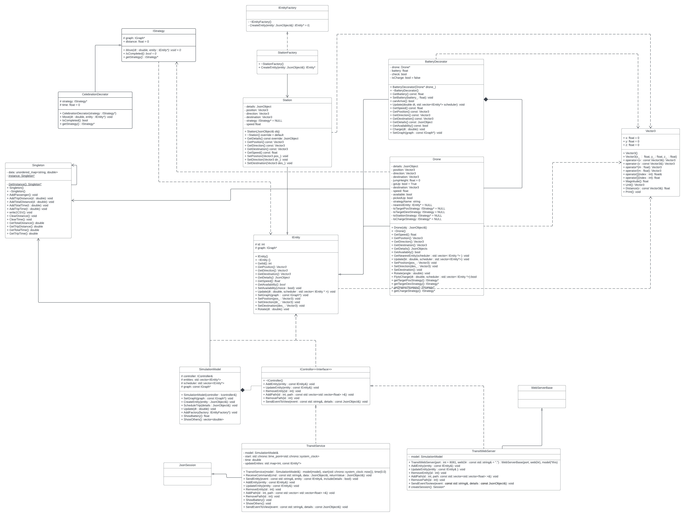

# 3081 Homework04 - New features
_(Due: Thursday, Dec. 16, 2022 @ 11:59pm)_

## General Information

### Team infomation

Team 001-9. Haibo Wang wan00220, Linghe Wang wang9257, Yanzheng Wu wu001026, Ruijun Ni nee00011

### Project Overview

This is a simulation that contain drone, robots, and 3D UMN map. We can schedule trips for robot on the map. The drone will pick up robot and send it to destination to finish the trip.

## How to run the simulation

### Accesing a Lab Machine

For this assignment, we suggest you use a lab machine in ***Keller Hall 1-250*** or ***Keller Hall 1-262*** ([details](https://cse.umn.edu/cseit/classrooms-labs#cselabs)). You can access a lab machine remotely using [VOLE](https://github.umn.edu/umn-csci-3081-F22/shared-upstream/tree/main/FAQs/VOLE), FASTX, and [SSH](https://github.umn.edu/umn-csci-3081-F22/shared-upstream/tree/main/FAQs/SSH). If you do not already have a CSE account, create the account following these [instructions](https://wwws.cs.umn.edu/account-management).

If you are using FASTX, you can access the machine by going to the webpage https://csel-kh1250-XX.cselabs.umn.edu where XX is the machine identifier number, and `kh1250` represents the machine is in the Keller 1-250 lab. In Keller 1-250, the machine numbers are 01-37, and in Keller 1-262 the machine numbers are 01-28. Please do not use the machine in the example below, choose a different one so the entire class isn't trying to work off of the same computer. For example, if you choose to use machine 09 in Keller 1-250, you should type into your web browser [https://csel-kh1250-09.cselabs.umn.edu](https://csel-kh1250-09.cselabs.umn.edu) to connect to your machine. Use your CSE account to login to the machine. One you login, click the + icon in the top left to create a new session, then choose XFCE and click Launch.

If you are using SSH, you will use the same hostnames as described in how to connect with FASTX. For example, if you'd like to connect to machine 09 in Keller 1-250, you will do `ssh X500@csel-kh1250-09.cselabs.umn.edu`, where `X500` is your x500 ID that is registered as a CSE Labs account.

**IMPORTANT: Inside the lab machine, only files saved to your home folder (e.g., `/home/kaung006`) will be persisted across sessions. If you log out, make sure your progress is pushed to GitHub or saved in the home folder.**

### Diskquota Exceed
One of the reasons you might not be able to log into a lab machine is that you reached your CSE Labs Account disk quota. <br>
To free up space, [see here](https://github.umn.edu/umn-csci-3081-F22/shared-upstream/tree/main/FAQs/CSE%20Disk%20Quota%20Exceeds)

### Retrieve Materials(Docker)
You have two ways to get the materials

1. Clone **Team-001-9-homework04** repo
    ```bash
    git clone git@github.umn.edu:umn-csci-3081-F22/Team-001-9-homework04.git
    ```
2. Download the zip in the main branch.

3. Download the Docker image. Here is the link: https://hub.docker.com/repository/docker/ryan0915/team-001-9-homework04

### Compile and Run
1. Make sure your linux OS is installed and running. Locate to the root directory, then complie the program using following command.
    ```
    # Go to the project directory
    cd /path/to/repo/project
    
    # Build the project 
    make -j
    ```
2. Please run the program using the following command.
    ```
    # Run the project (./build/web-app <port> <web folder>)
    ./build/bin/transit_service 8081 apps/transit_service/web/
    ```
   **Note**: If port 8081 is not available, choose a different port (e.g. 8082, 8083, etc...)
3. Navigate to http://127.0.0.1:8081 and you should see a visualization.

   Navigate to http://127.0.0.1:8081/schedule.html and you should see a page to schedule the trips.
4. Setting the start postion and destination by clikcing on 2D map in http://127.0.0.1:8081/schedule.html. Set the name of trip and moving strategy on      the upper left corner. Then, click the schedule trip in the lower left corner. Now, switch to http://127.0.0.1:8081, you can see the animation.

## What does the simulation do
We build a 3D map of UMN. There are robots and drone entities that exist on this map. The drone will appear at its initialized position when you build the project. Then you can schedule trips by setting up the starting position and destination for the robot. The drone will finish scheduled trips one by one. At first, the drone will check if its current energy can support the trip. If it is, the drone will pick up the robot and send it to the destination. Otherwise, the drone will first go to the energy station to recharge. Then it will continue the trip(go to pick up the robot and send it to the destination).The project will show the drone's current energy, distance, and elapsed time on the screen. This information is stored in the data.csv, which is located in this project's root directory.

## New features

### Drone Battery
We have added a battery to the drone. The battery power will decrease as the drone move and increase as the drone recharge. The battery determines the cruising distance of the drone. It is interesting because the drone needs a battery to make it realistic. In addition,moving to the energy station and a 3D model of the energy station makes this simulation more entertaining. 

We choose the decorator design pattern. It's a structural design pattern that lets you attach new behaviors to objects by placing these objects inside special wrapper objects that contain the behaviors. The battery is the new behavior of the drone, so we place the drone inside the battery wrapper object.

We create a battery class that inherits from IEntity. We modified the drone factory. It creates the drone and warps it using the battery. The battery is responsible for the drone's moving, power consumption, and recharging. Because the drone entity no longer exists in the simulation entity list, it cannot get the graph. Thus, we write a function "SetGraph" in battteryDecrator.cc to help the drone get the graph. 
 
The canArrive() function in batterDecorator.cc is responsible for checking if battery power is enough for the distance. 
Here is how distance is calculated.
We add a new member variable to the Istrategy called "distance." We use euclidian distance to calculate the total distance of the path for four strategies. When the trip is scheduled, we calculate the total distance of picking up the robot, dropping off the robot, and flying to the power station. To ensure it can arrive at the power station after one trip, we take the distance of fly to the power station into account. Then, we sum them up. The current energy must support the drone to finish the total distance. Otherwise, it will fly to the power station and recharge. 

We also have an Update() function in batteryDecrator.cc. This function is responsible for updating the battery power. The battery power will increase when the drone recharge and decrease when the drone move. We will use canArrive() to check if the drone can finish the trip. If it is, the drone will pick up the robot and send it to the destination. Otherwise, it will go to recharge first, and then it will continue the trip.

No additional or special instructions are needed to use this new feature. To run the program, please only follow the instruction in the "How to run the simulation" section.

### Data Collection
The other new feature we create is the data collection feature. We collect data from the drone in the backend using the Singleton pattern, display it in the front end, and write it to a CSV file.
For the Singleton pattern, we ensure that a class has only one instance while providing a global access point to this instance. Specifically, we have the same instance of Singleton to collect the number of delivered passengers, traveling distance, trip distance, total time, and traveling time per scheduled trip. Finally, we can have the .csv file containing the whole data.
As for the front end, we get the data from the backend in the simulation model through web sockets in the transit service and then display the data of the battery level, time, and distance on the main page.

| Drone No. |  Passengers Delivered |  Distance Traveled |  Distance Traveled (trips only) |  Total Time |  Time Elapsed (trips only) |
|-----------|-----------------------|--------------------|---------------------------------|-------------|----------------------------|
| drone1    | 1                     | 2375.1             | 1602                            | 158.34      | 53.4                       |
| drone1    | 2                     | 2834.38249         | 2178.88249                      | 94.479416   | 72.629416                  |
| drone1    | 3                     | 2312.959195        | 1609.5                          | 77.09864    | 53.65                      |
| drone1    | 4                     | 2777.283428        | 2123.7                          | 92.576114   | 70.79                      |
| drone1    | 5                     | 2994.089997        | 2016.82247                      | 186.117749  | 67.227416                  |
| drone1    | 6                     | 3414.713462        | 2753.4                          | 113.823782  | 91.78                      |
| drone1    | 7                     | 2119.93609         | 963.260188                      | 70.664536   | 32.108673                  |
| drone1    | 8                     | 1849.8             | 973.2                           | 61.66       | 32.44                      |
| drone1    | 9                     | 1871.601514        | 993.201514                      | 62.386717   | 33.106717                  |

In the data analysis, our goal is to find the strategy which could provide the shortest path from the starting position to the destination on the map.
Since the total distance and total time may contain the data of the path to the charge station, we cannot compare the total distance and total time.
We can get the consequence by comparing the column data of distance traveled (trips only) and time elapsed (trips only). In our CSV file, we have three groups of data. Each group of three rows of data is the scheduled trip with Astar strategy, DFS strategy, and Dijkstra Strategy. In addition, each data group has the same starting point and destination. Three groups of data correspond to three different schedules, which are from (667.0, 308.6) to (236.0, 300.6), (763.0, 482.6) to (713.0, 146.6), and (246.0, 529.6) to (432.0, 292.6) respectively. According to the drone's traveling data, the first row of data always has the shortest path and traveling time in each of the three groups. Hence, the Astar strategy could always provide the shortest path and the shortest traveling time among these three strategies.

## Sprint Retrospective
In this project, we applied Agile methodology for project management. We used Scrum to create a fixed-length iteration called "sprint." Before we started the sprint, our team created tasks we planned to do in the "Backlog." For example, we created tasks like "get idea checked off," "add charge station entity," "display battery level in the frontend," etc. And then, we start the sprint. We have *daily standup meetings* and assign tasks to teammates. Applying the Agile methodology improves flexibility, collaboration, transparency, and delivery speed. Agile encourages our team to work together and share information openly and transparently. This helps foster teamwork and accountability among team members and can lead to better collaboration and more efficient problem-solving. What went well in our sprint included meeting the sprint goals and objectives, delivering high-quality work, maintaining good communication, and good collaboration within the team. What could have gone better in our sprint was that we experienced challenges and obstacles that slowed progress. For example, we encountered a bug when writing the battery decorator, which took us more time than estimated to finish this part. Then we communicated with teammates, decided to adjust our timeline, and spent more time on this task, even devoting the weekend to completing the task. We learned from using Agile sprint in this project that it is essential to plan ahead, communicate openly and transparently with the team, monitor progress, and adjust the plan as needed.

## UML Diagram

